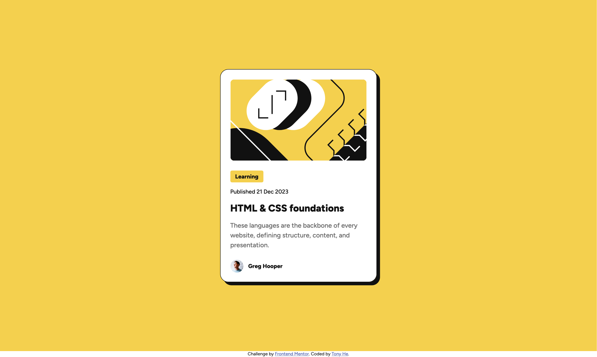

# Frontend Mentor - Blog preview card solution

This is a solution to the [Blog preview card challenge on Frontend Mentor](https://www.frontendmentor.io/challenges/blog-preview-card-ckPaj01IcS). Frontend Mentor challenges help you improve your coding skills by building realistic projects. 

## Table of contents

- [Overview](#overview)
  - [The challenge](#the-challenge)
  - [Screenshot](#screenshot)
  - [Links](#links)
- [My process](#my-process)
  - [Built with](#built-with)
  - [What I learned](#what-i-learned)
  - [Useful resources](#useful-resources)
- [Author](#author)

## Overview

### The challenge

Users should be able to:

- See hover and focus states for all interactive elements on the page

### Screenshot



### Links

- Solution URL: https://www.frontendmentor.io/solutions/blog-preview-card-zhwOCC9fPw
- Live Site URL: https://tonyhaohe.github.io/frontendmentors-2-blog-card/

## My process

### Built with

- Semantic HTML5 markup
- CSS custom properties
- Flexbox

### What I learned

If you want a flex item to not stretch in the cross axis (e.g. the item is not just showing its size but is stretching vertically too much when the `flex-direction: row` or stretching horizontally for when `flex-direction: column`), you should set `align-items: flex-start`, which overrides the default of `align-items: stretch`. 

If you have multiple text presets, you can define css class selectors to apply them. Or you could also group those rules with normal element selectors if it helps to have the class name beside the rule to make it clear it's for a specific preset. E.g: 

```css
    .text-preset-1, h1{
      font-weight: 800;
      font-size: 24px;
      line-height: 150%;
    }
```

Keep in mind that css has limited keywords for font weight. You will need to go onto the online font and find the number for a weight like extra bold. 

### Useful resources

- https://www.theodinproject.com/ - I use this quite a lot. You can type anything and then "odin project" and something useful might come up.

## Author

- Website - [Tony He](https://tonyhaohe.github.io/frontendmentors-2-blog-card/)
- Frontend Mentor - [@tonyhaohe](https://www.frontendmentor.io/profile/tonyhaohe)
- Linkedin - [Tony He](https://linkedin.com/in/tony-he-birmingham)
